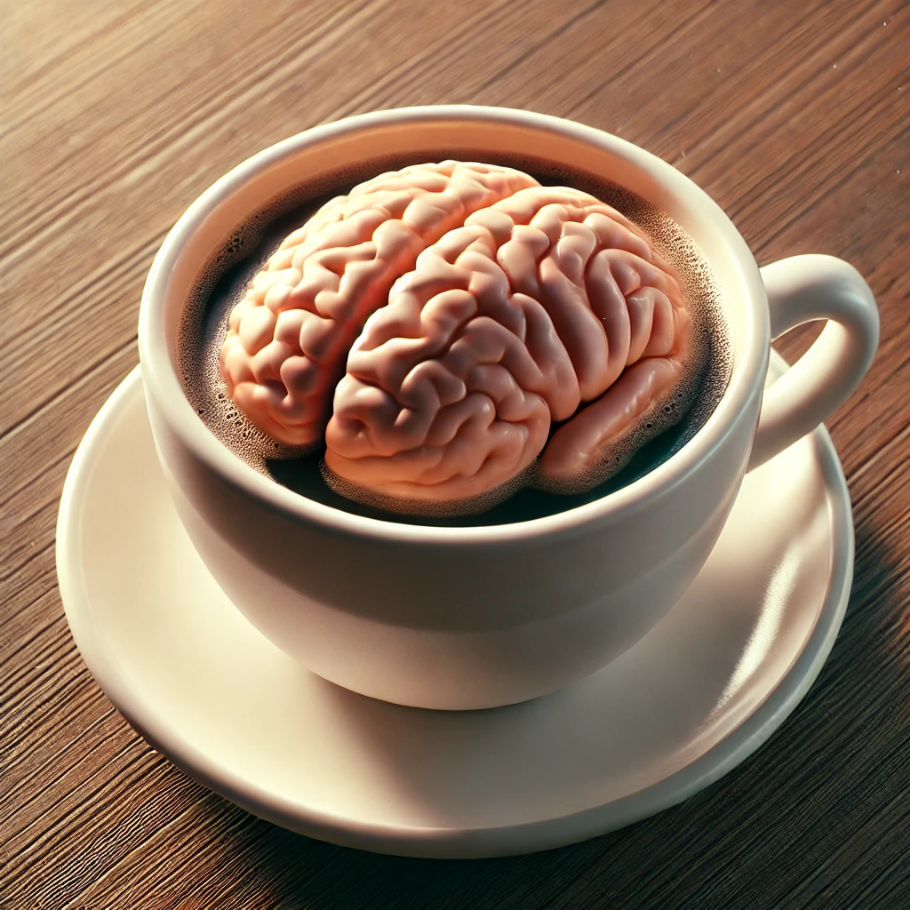

# Brain In Cup



I'm a project designed to simulate human cognitive processes using agentic large language models (LLMs) and a recurring feedback loop system. The application is structured as a monolithic Rust-based implementation for high performance, deployability, and simplicity.

## Functional Agents and Workflow:
1.	Perception Agent: Receives and processes input to initiate the workflow.
2.	Memory Agent: Retrieves contextual information about the user, such as preferences, weather, or schedules.
3.	Reasoning Agent: Analyzes the context and formulates potential decisions based on input.
4.	Emotional Agent: Adjusts decisions with predefined biases (e.g., risk-taking or caution).
5.	Language Agent: Converts decisions into clear, human-readable output.
6.	Self-Agent: Acts as a final review layer, modifying or overriding the output when necessary.

```xml
<dropdown>
  <option value="1">More Docs</option>
Agent Communication Architecture

Key Components
	1.	Central Controller (Coordinator):
	•	Acts as the orchestrator.
	•	Routes messages between agents in a predefined sequence.
	•	Maintains a shared memory/context store that agents can read/write to.
	2.	Agents:
	•	Independent modular components (e.g., Perception Agent, Memory Agent).
	•	Each agent focuses on its specific task (input processing, context retrieval, reasoning, etc.).
	•	Communicates only with the Central Controller.
</dropdown>
```
```xml
